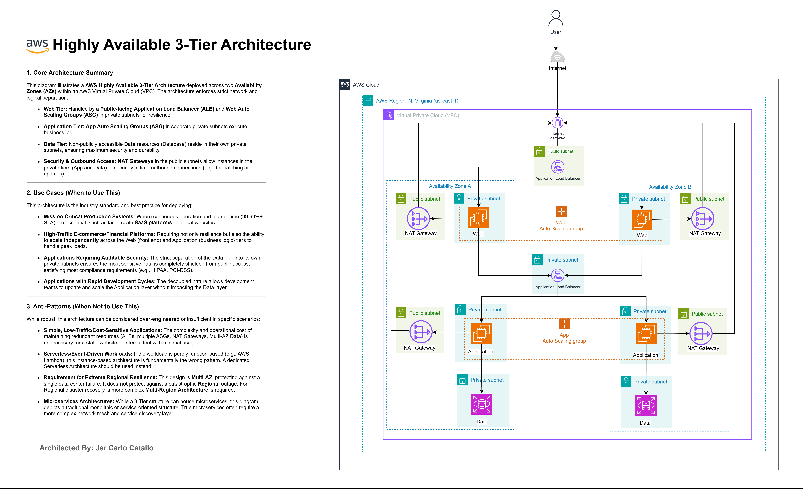
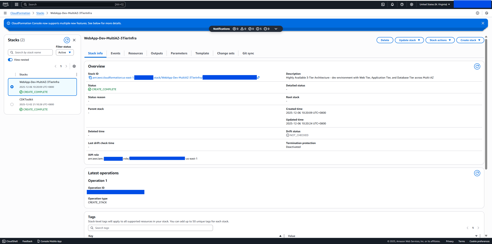
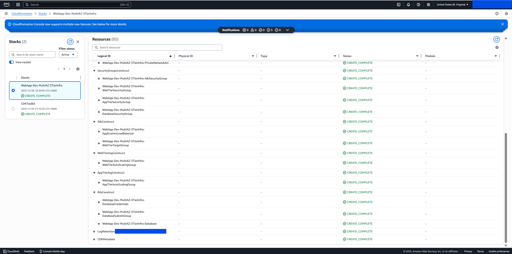
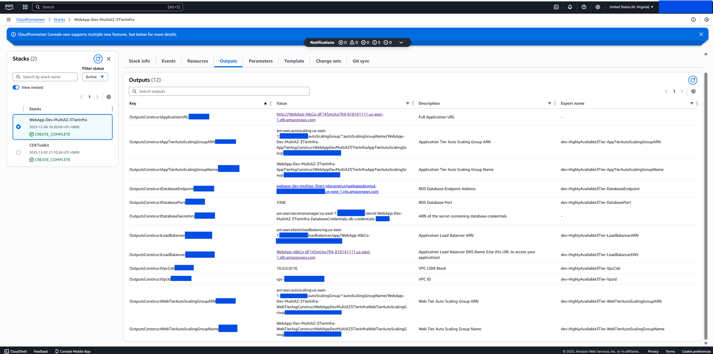
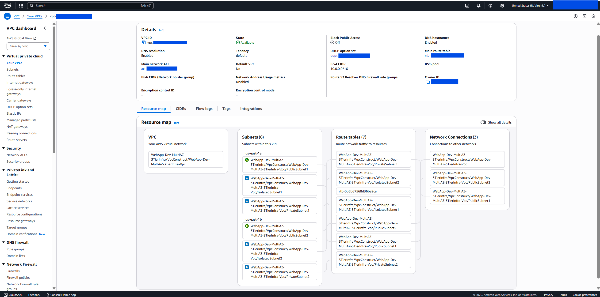
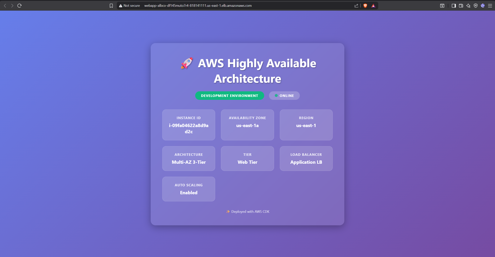

# AWS Highly Available 3-Tier Architecture


> **Production-grade infrastructure made repeatable**: Deploy highly available, auto-scaling 3-tier applications across multiple availability zones with battle-tested Infrastructure as Code.

**⚠️ EDUCATIONAL PURPOSE ONLY**: This project is designed for learning AWS infrastructure patterns and CDK development. Not intended for production use without proper review, testing, and customization.

**📝 Architecture Note**: This is a **true 3-tier architecture** implementing the industry-standard separation of concerns with a Presentation Layer (Web Tier), Business Logic Layer (Application Tier), and Data Layer (RDS Database). Each tier scales independently and communicates through defined interfaces.

---

## Quick Start

### Prerequisites
- AWS CLI configured with credentials
- Node.js 18+ and npm
- AWS CDK CLI: `npm install -g aws-cdk`

### Deploy in 3 Steps

```bash
# 1. Install dependencies
npm install

# 2. Configure environment
cp .env.example .env
# Edit .env: ENVIRONMENT=development (or production or staging)

# 3. Deploy
cdk deploy
```

Infrastructure deploys in ~15-20 minutes.

---

## Key Features

- **True 3-Tier Architecture** - Presentation (Web), Business Logic (App), and Data (RDS) tiers
- **Multi-AZ Deployment** - 2-3 availability zones for high availability across all tiers
- **Independent Auto Scaling** - Both Web and Application tiers scale based on CPU utilization
- **Managed RDS Database** - Multi-AZ RDS with automatic failover, backups, and encryption
- **Security Hardened** - Multi-layer defense with NACLs, Security Groups, tier isolation, encryption
- **JSON Configuration** - Environment-specific configs (dev/staging/prod) for all infrastructure
- **Infrastructure as Code** - Full TypeScript with AWS CDK for reproducible deployments
- **53 Unit Tests** - Comprehensive test coverage for all constructs and components

---

## Architecture Overview



This project implements a **True AWS Highly Available 3-Tier Architecture** - the industry-standard distributed architecture pattern for scalable applications. It features complete separation of concerns across three independent, scalable layers:

**Three Core Tiers:**
1. **Presentation Layer (Web Tier)** - Handles HTTP requests, serves static content, handles web sessions
2. **Business Logic Layer (Application Tier)** - Processes business logic, API services, application workflows
3. **Data Layer (RDS Database)** - Manages persistent data with multi-AZ replication and automatic failover

**Architecture Design Across Multiple Availability Zones (AZs):**

This diagram illustrates the **AWS Highly Available 3-Tier Architecture** deployed across multiple Availability Zones within an AWS Virtual Private Cloud (VPC), enforcing strict network and logical separation:

**Web Tier (Presentation Layer):**
- Handled by a public-facing Application Load Balancer (ALB) and Web Auto Scaling Groups (ASG) in private subnets
- Directly receives internet traffic through the Internet Gateway
- Communicates only with the Application Tier for business logic
- Scales independently based on web traffic and CPU utilization

**Application Tier (Business Logic Layer):**
- App Auto Scaling Groups (ASG) in separate private subnets execute business logic
- Not directly accessible from the internet (hidden behind Web Tier)
- Handles requests from Web Tier and queries the database
- Scales independently from Web Tier based on application logic demand

**Data Tier (Database Layer):**
- Non-publicly accessible Database resources in private subnets ensuring maximum security and durability
- RDS Multi-AZ deployment provides automatic failover and data redundancy
- Only accepts connections from Application Tier through security group rules

**Network & Outbound Access:**
- **Deployment Flow**: Internet Gateway → ALB (Public Subnets) → Web Tier (Private) → App Tier (Private) → RDS (Isolated Subnets)
- **NAT Gateways**: One per AZ for outbound internet access (patching, updates)
- **Multi-AZ**: Resources distributed across 2-3 Availability Zones for high availability and automatic failover
- **Tier Isolation**: Each tier has its own security group with restricted communication rules

---

## Screenshots

- CloudFormation stack overview for the dev Multi-AZ deployment: `CREATE_COMPLETE` with drift checks available.
	
- CloudFormation resources tree showing VPC, NACLs, Security Groups, ALB, and ASG constructs created by the stack.
	
- CloudFormation detailed resource tree with expanded construct details and resource relationships.
	
- CloudFormation stack outputs showing exported values for VPC, ALB, Web Tier, App Tier, and RDS endpoints.
	
- VPC resource map visualization showing network architecture with subnets, routing, and resource placement across availability zones.
	
- Deployed web app hero page served via the Application Load Balancer, showing instance metadata and Multi-AZ 3-tier status.
	

---

## When to Use This Architecture

### ✅ Use Cases (Ideal Scenarios)

**1. Mission-Critical Production Systems**
- Where continuous operation and high uptime (99.99%+ SLA) are essential
- Large-scale SaaS platforms or global websites
- Applications requiring high availability across multiple availability zones
- Traditional web applications requiring high availability
- Applications with database-backed features

**2. High-Traffic E-commerce & Financial Platforms**
- Systems requiring resilience and the ability to scale independently across tiers
- Web tier (front end) and Application tier (business logic) scaling separately to handle peak loads
- Applications with distinct frontend and backend services
- Systems requiring tier-based autoscaling policies

**3. Applications Requiring Auditable Security & Compliance**
- Business applications with strict security and compliance requirements (HIPAA, PCI-DSS)
- Systems requiring separated presentation and business logic layers with data isolation
- Strict separation of the Data Tier into private subnets ensuring sensitive data is completely shielded from public access
- Applications needing audit trails and data governance (RDS native support)

**4. Applications with Rapid Development Cycles**
- The decoupled nature allows development teams to update and scale the Application layer without impacting the Data layer
- Systems where independent tier scaling is essential

**5. Scalability with Managed Database**
- Applications needing reliable, managed data persistence
- Systems requiring automated backups, multi-AZ failover, and point-in-time recovery
- Production workloads where data durability is critical

**6. Learning & Demonstration**
- Understanding 3-tier architecture patterns and AWS best practices
- CDK infrastructure as code with class-based constructs
- AWS infrastructure design with proper separation of concerns

### ❌ Anti-Patterns (When NOT to Use This)

**1. Simple, Low-Traffic/Cost-Sensitive Applications**
- **Issue**: The complexity and operational cost of maintaining redundant resources (ALBs, multiple ASGs, NAT Gateways, Multi-AZ Data) is unnecessary for simple applications
- **Scenarios**: Static websites, internal tools with minimal usage, low-traffic applications
- **Better Alternative**: Smaller single-instance deployments, serverless (Lambda, DynamoDB), or S3 + CloudFront

**2. Serverless/Event-Driven Workloads**
- **Issue**: If the workload is purely function-based (e.g., AWS Lambda), this instance-based architecture is fundamentally the wrong pattern
- **Scenarios**: Lambda-driven applications, event-based processing, batch jobs
- **Better Alternative**: Dedicated Serverless Architecture with Lambda, API Gateway, and managed databases

**3. Requirement for Extreme Regional Resilience**
- **Issue**: This design is Multi-AZ, protecting against a single data center failure. It does not protect against a catastrophic Regional outage
- **Scenarios**: Global applications requiring disaster recovery across regions, mission-critical systems with geographic redundancy needs
- **Better Alternative**: Multi-Region Architecture for cross-region failover and disaster recovery

**4. True Microservices Architectures**
- **Issue**: While a 3-Tier structure can house microservices, this diagram depicts a traditional monolithic or service-oriented structure. True microservices often require different patterns
- **Scenarios**: Applications with 10+ independent services, requiring service mesh and sophisticated service discovery
- **Better Alternative**: Containerized microservices (ECS/EKS) with service mesh (Istio) or serverless microservices

**5. Real-time Analytics/Streaming**
- **Issue**: RDS may not be optimal for high-throughput analytics and streaming data
- **Better Alternative**: Data warehouses (Redshift), streaming platforms (Kinesis), or specialized analytics databases

---

# Architecture Components

### Network Layer (VPC)

**VPC Configuration:**
- **CIDR**: 10.0.0.0/16
- **Availability Zones**: 2 (dev/staging) or 3 (production)
- **Public Subnets**: Host ALB and NAT Gateways (10.0.0.0/24, 10.0.1.0/24)
- **Private Subnets**: Host Web Tier and App Tier ASG instances (10.0.10.0/24, 10.0.11.0/24)
- **Database Subnets**: Host RDS Multi-AZ instances (10.0.20.0/24, 10.0.21.0/24)

**Application Load Balancer (ALB):**
- **Target Type**: Web Tier EC2 instances only
- **Cross-Zone**: Enabled for even distribution across AZs
- **Idle Timeout**: 60 seconds (configurable)
- **Health Checks**: Every 30 seconds on the Web Tier

### Tier 1: Presentation Layer (Web Tier)

**Web Tier Auto Scaling Group:**
- **Purpose**: Handles HTTP/HTTPS requests, serves static content, manages sessions
- **Placement**: Private subnets across multiple AZs
- **Load Balancer Target**: Directly attached to ALB target group
- **Scaling Policy**: Target tracking based on CPU utilization (60-70%)
- **Communication**: Can only communicate with ALB (inbound) and App Tier (outbound)

### Tier 2: Business Logic Layer (Application Tier)

**Application Tier Auto Scaling Group:**
- **Purpose**: Processes business logic, handles API requests, manages workflows
- **Placement**: Private subnets across multiple AZs (same as Web Tier)
- **Load Balancer**: NOT attached to ALB (internal tier only)
- **Scaling Policy**: Target tracking based on CPU utilization
- **Communication**: Receives requests from Web Tier (inbound), communicates with RDS Database (outbound)

### Tier 3: Data Layer (RDS Database)

**RDS Multi-AZ Configuration:**
- **Engine**: MariaDB 10.11 (configurable per environment)
- **Availability**: Multi-AZ deployment with automatic failover
- **Storage**: Auto-scaling (20-30GB initial, up to 100-200GB)
- **Backups**: Automated retention 7-30 days (environment-specific), point-in-time recovery enabled
- **Security**: Encrypted at rest (AWS KMS) and in transit, credentials via AWS Secrets Manager
- **Access**: Only accepts connections from App Tier security group

### Data & Storage Architecture

- **Persistent Data**: Managed by RDS Multi-AZ for durability and high availability
- **Backups**: Automated with environment-specific retention (7-30 days)
- **Recovery**: Multi-AZ automatic failover, point-in-time recovery available
- **EBS Volumes**: Encrypted at rest (AWS KMS) for OS and temporary data on EC2 instances

### Security Architecture

**Defense in Depth (Multi-Layer Security):**

1. **Network ACLs (Subnet-level, stateless):**
   - **Public Subnet**: Allow HTTP (80), HTTPS (443), ephemeral ports (1024-65535)
   - **Private Subnet (Tier 1 & 2)**: Restrict to ALB traffic and inter-tier communication
   - **Database Subnet**: Allow database port (3306) from App Tier only, deny all other inbound

2. **Security Groups (Instance-level, stateful):**
   - **ALB Security Group**: 
     - Inbound: HTTP (80) from 0.0.0.0/0
     - Outbound: HTTP to Web Tier security group
   - **Web Tier Security Group**:
     - Inbound: HTTP (80) from ALB security group only
     - Outbound: HTTP/S to App Tier security group and NAT (updates)
   - **App Tier Security Group**:
     - Inbound: Custom port from Web Tier security group only
     - Outbound: MySQL (3306) to Database security group and NAT (updates)
   - **Database Security Group**:
     - Inbound: MySQL (3306) from App Tier security group only
     - Outbound: None (RDS managed)

3. **Tier Isolation:**
   - Tiers cannot communicate across boundaries (Web cannot reach DB, for example)
   - Each tier has minimal required permissions following least privilege principle
   - Inter-tier communication through defined security group rules

4. **Encryption:**
   - All EBS volumes encrypted at rest (AWS KMS)
   - RDS storage encrypted at rest (AWS KMS)
   - RDS connections encrypted in transit
   - Secrets Manager for credential management
   - IMDSv2 enforcement prevents credential theft

5. **Database Security:**
   - Credentials stored securely in Secrets Manager
   - No direct internet access to database (private database subnets)
   - Automatic encrypted backups retained per environment policy

## Traffic Flow

```
User Browser → Internet → Internet Gateway → ALB (Public Subnet) 
  → Web Tier ASG (Private Subnet - Presentation)
  → App Tier ASG (Private Subnet - Business Logic)
  → RDS Multi-AZ Database (Private Database Subnet - Data)
```

**Step-by-step Traffic Flow:**
1. User requests arrive at Internet Gateway
2. ALB receives traffic on port 80/443 and performs health checks on Web Tier
3. Healthy Web Tier instances receive distributed requests
4. Web Tier communicates with App Tier for business logic processing
5. App Tier queries RDS database for data operations
6. RDS returns data to App Tier (automatic failover to standby if needed)
7. App Tier returns results to Web Tier
8. Web Tier returns response to user
9. NAT Gateways enable outbound internet for updates/patches (each tier independently)

**Tier Isolation:**
- Web Tier cannot directly access Database (must go through App Tier)
- Traffic flows strictly through layers
- No cross-tier shortcuts or back-doors
- Security groups enforce these boundaries

## High Availability Features

### Multi-AZ Redundancy
- **ALB**: Automatically distributes across AZs in public subnets
- **Web Tier**: Instances balanced across AZs (minimum 1 per AZ)
- **App Tier**: Instances balanced across AZs (minimum 1 per AZ)
- **RDS Database**: Primary and standby replicas in different AZs
- **NAT Gateways**: One per AZ (independent failure domains)

### Automatic Failover
- **Web/App Tier ASGs**: Automatically replace failed instances (3-5 minutes)
- **RDS Database**: Automatic failover to standby in different AZ (typically < 2 minutes)
- **ALB**: Routes traffic only to healthy targets, removes failed instances

### Health Monitoring
- ALB health checks on Web Tier every 30 seconds
- ASG health checks monitor EC2 instance status
- RDS health monitoring with automatic failover detection
- CloudWatch alarms for critical metrics across all tiers
- VPC Flow Logs capture network traffic for troubleshooting

### Recovery Time Objectives (RTO) & Recovery Point Objectives (RPO)
- **Instance Failure**: RTO ~3-5 minutes (ASG replacement)
- **Database Failure**: RTO ~1-2 minutes (RDS automatic failover), RPO ~5 minutes (automated backups)
- **AZ Failure**: RTO ~5-10 minutes (re-provisioning in remaining AZs)

## Scalability

### Horizontal Scaling (Compute)
- **Web Tier Auto Scaling**: Adjusts capacity based on CPU utilization (60-70% threshold)
- **App Tier Auto Scaling**: Independently scales based on CPU utilization
- **Scale-out**: 60 seconds cooldown (rapid response to traffic spikes)
- **Scale-in**: 300 seconds cooldown (prevent flapping during traffic fluctuations)
- **Independent Tier Scaling**: If Web Tier receives more traffic, only Web Tier scales (not App Tier)

### Vertical Scaling (Database)
- **RDS Storage Auto-Scaling**: Automatically increases storage up to configured max (100-200GB)
- **RDS Read Replicas**: Can add read-only replicas for read-heavy workloads (optional extension)
- **Manual Upgrades**: RDS instance type can be changed with brief downtime during maintenance window

### Stateless Design
- Web Tier instances are stateless (can be replaced instantly)
- App Tier instances can leverage session stores (ElastiCache extension) for state management
- All persistent data stored in RDS (not local to instances)

### Scaling Limits
- Web Tier: Dev (max 6), Staging (max 8), Production (max 10)
- App Tier: Dev (max 6), Staging (max 8), Production (max 10)
- RDS: Automatically scales storage; instance type upgrade available
- ALB: Handles unlimited concurrent connections (AWS managed)

## Cost Optimization

| Environment | Est. Monthly Cost | Components |
|-------------|-------------------|------------|
| Development | $80-120 | t2.micro ASGs (2 tiers), db.t3.micro RDS, 2 NAT Gateways, 2 AZs |
| Staging | $120-180 | t3.small ASGs (2 tiers), db.t3.micro RDS, 2 NAT Gateways, 2 AZs |
| Production | $200-300 | t3.small ASGs (2 tiers), db.t3.small RDS, 3 NAT Gateways, 3 AZs |

**Cost Factors:**
- **EC2 Instances**: Web Tier + App Tier (both tiers contribute)
- **RDS Database**: Multi-AZ, storage, backup retention, automated backups
- **NAT Gateways**: Data transfer (~$45/month per gateway)
- **EBS Storage**: Encrypted GP3 volumes for both tiers
- **Data Transfer**: ALB to instances, inter-tier traffic, outbound internet
- **Load Balancer**: ALB hourly charge plus data processing costs

**Cost Optimization Tips:**
- Use Reserved Instances for predictable production workloads
- Configure ASG scaling policies to match actual traffic patterns
- Monitor RDS storage auto-scaling to avoid unexpected large bills
- Use AWS Cost Explorer to track spend by tier and component
- Consider removing App Tier NAT Gateway if only internal communication needed
- Schedule non-production environments to turn off during off-hours

## Monitoring & Logging

- **VPC Flow Logs**: Network traffic analysis for all subnets (7-30 day retention)
- **CloudWatch Logs**: Application logs from Web and App Tier instances
- **CloudWatch Metrics**: 
  - EC2: CPU, memory, network, disk utilization (per tier)
  - ASG: Scaling activity, desired/actual capacity
  - ALB: Request count, target health, response time
  - RDS: CPU, connections, storage, replication lag, backup duration
- **ALB Monitoring**: Health checks, target health, scaling events
- **RDS Monitoring**: Database connection metrics, query performance, backup status
- **Log Retention**: 
  - Development: 7 days (all services)
  - Staging: 14 days (all services)
  - Production: 30 days (all services)
- **Alarms**: Pre-configured for high CPU, unhealthy targets, database failover events
- **Database Logging**: Error logs, general logs, slow query logs exported to CloudWatch

## Best Practices

✅ **3-Tier Separation**: Keep presentation, business logic, and data concerns separate  
✅ **Tier Isolation**: Use security groups to enforce communication between tiers only  
✅ **RDS Backups**: Enable automated backups with appropriate retention for your environment  
✅ **Auto Scaling**: Configure policies based on actual traffic and resource consumption patterns  
✅ **Database Credentials**: Store RDS credentials in Secrets Manager, never in code  
✅ **Monitoring**: Enable CloudWatch alarms for CPU, database connections, and failover events  
✅ **Testing**: Regular failover tests to validate RTO/RPO  
✅ **Logging**: Maintain comprehensive logs for troubleshooting and compliance  
✅ **IMDSv2**: Always enforce IMDSv2 on EC2 instances for security  
✅ **Cost Monitoring**: Use AWS Cost Explorer to track spend per tier and component  

---

## Project Structure

```
├── bin/
│   ├── app.ts                      # CDK app entry point
│   └── app.js                      # Compiled JavaScript
├── lib/
│   ├── stack.ts                    # Main 3-tier stack definition
│   ├── stack.js                    # Compiled stack
│   └── constructs/                 # Modular reusable constructs
│       ├── compute/                # Auto Scaling Group constructs
│       │   ├── asg-construct.ts    # Base ASG construct
│       │   ├── web-tier-asg-construct.ts    # Web tier (Presentation)
│       │   └── app-tier-asg-construct.ts    # App tier (Business Logic)
│       ├── database/               # RDS Database construct
│       │   └── database-instance-construct.ts
│       ├── load-balancing/         # Application Load Balancer
│       │   └── alb-construct.ts
│       ├── networking/             # Network infrastructure
│       │   ├── vpc-construct.ts    # VPC and subnets
│       │   ├── security-group-construct.ts  # Security groups (4 tiers)
│       │   └── network-acl-construct.ts     # Network ACLs
│       └── outputs/                # CloudFormation outputs
│           └── outputs-construct.ts
├── config/                         # Environment-specific configuration
│   ├── development.json            # Dev environment settings
│   ├── staging.json                # Staging environment settings
│   ├── production.json             # Prod environment settings
│   ├── stack-config.ts             # Configuration loader with type safety
│   └── stack-config.js             # Compiled config
├── scripts/                        # User data scripts per tier/environment
│   ├── web-tier-user-data-dev.sh
│   ├── web-tier-user-data-staging.sh
│   ├── web-tier-user-data-production.sh
│   ├── app-tier-user-data-dev.sh
│   ├── app-tier-user-data-staging.sh
│   └── app-tier-user-data-production.sh
├── test/                           # Comprehensive unit tests
│   ├── stack.test.ts               # Main stack tests
│   └── constructs/                 # Individual construct tests
│       ├── alb-construct.test.ts
│       ├── asg-construct.test.ts
│       ├── database-instance-construct.test.ts
│       ├── network-acl-construct.test.ts
│       ├── outputs-construct.test.ts
│       ├── security-group-construct.test.ts
│       └── vpc-construct.test.ts
├── assets/                         # Documentation and screenshots
│   └── aws-screenshots/            # Deployment screenshots
├── .github/                        # GitHub workflows and templates
├── .env.example                    # Environment variable template
├── .gitignore
├── cdk.json                        # CDK configuration
├── cdk.context.json                # CDK context values
├── jest.config.js                  # Jest testing configuration
├── package.json                    # Dependencies and scripts
├── tsconfig.json                   # TypeScript configuration
├── LICENSE                         # MIT License
└── README.md                       # This file
```

---

# Configuration Guide

## ⚙️ Configuration-Driven Architecture

This project is **fully configuration-driven** using **JSON configuration files** for different environments. All infrastructure parameters are externalized - change settings without modifying any TypeScript code!

## How It Works

```
.env file (ENVIRONMENT=dev or production)
       ↓
development.json or production.json (JSON Configuration)
       ↓
stack-config.ts (Loads JSON + Type Safety)
       ↓
Stack Constructs (Implementation)
       ↓
AWS Resources (Deployment)
```

## Environment-Specific Configuration Files

### Development Configuration

**`config/development.json`** - Development environment settings:

```json
{
  "stackName": "WebApp-Dev-MultiAZ-3TierInfra",
  "environment": {
    "name": "dev",
    "region": "us-east-1"
  },
  "compute": {
    "webTier": {
      "minCapacity": 2,
      "maxCapacity": 6,
      "desiredCapacity": 2,
      "instanceClass": "T2",
      "instanceSize": "MICRO"
    },
    "appTier": {
      "minCapacity": 2,
      "maxCapacity": 6,
      "desiredCapacity": 2,
      "instanceClass": "T2",
      "instanceSize": "MICRO"
    }
  },
  "database": {
    "engine": "mariadb",
    "engineVersion": "10.11",
    "instanceClass": "T3",
    "instanceSize": "MICRO",
    "allocatedStorage": 20,
    "maxAllocatedStorage": 100,
    "multiAz": true,
    "backupRetention": 7
  },
  "network": {
    "availabilityZones": 2,
    "enableFlowLogs": true
  }
}
```

### Production Configuration

**`config/production.json`** - Production environment settings:

```json
{
  "stackName": "WebApp-Prod-MultiAZ-3TierInfra",
  "environment": {
    "name": "production",
    "region": "us-east-1"
  },
  "compute": {
    "webTier": {
      "minCapacity": 3,
      "maxCapacity": 10,
      "desiredCapacity": 3,
      "instanceClass": "T3",
      "instanceSize": "SMALL"
    },
    "appTier": {
      "minCapacity": 3,
      "maxCapacity": 10,
      "desiredCapacity": 3,
      "instanceClass": "T3",
      "instanceSize": "SMALL"
    }
  },
  "database": {
    "engine": "mariadb",
    "engineVersion": "10.11",
    "instanceClass": "T3",
    "instanceSize": "SMALL",
    "allocatedStorage": 30,
    "maxAllocatedStorage": 200,
    "multiAz": true,
    "backupRetention": 30,
    "deletionProtection": true
  },
  "network": {
    "availabilityZones": 3,
    "enableFlowLogs": true
  }
}
```

## Switching Between Environments

### Using .env file (Recommended)

```bash
# Create .env file
cp .env.example .env

# Edit .env file
# For development:
ENVIRONMENT=dev

# For production:
ENVIRONMENT=production

# Deploy
npx cdk deploy
```

### Using environment variable

```bash
# Development deployment
ENVIRONMENT=dev npx cdk deploy

# Production deployment
ENVIRONMENT=production npx cdk deploy
```

## What You Can Configure

✅ **Stack & Resources**: Stack name, resource names with prefixes, tags  
✅ **Network**: VPC CIDR, subnet masks, NAT gateway count, Flow Logs, AZ count  
✅ **Security**: Ports, protocols, CIDR ranges, Network ACLs, tier isolation rules  
✅ **Load Balancer**: Health checks, timeouts, protocols, deregistration delay  
✅ **Web Tier**: Capacity, instance types, scaling policies, cooldowns, health checks  
✅ **App Tier**: Capacity, instance types, scaling policies, cooldowns, health checks  
✅ **RDS Database**: Engine, version, instance type, storage, multi-AZ, backups, encryption  
✅ **EC2 Instances**: User data scripts, storage, IMDSv2 settings (per tier)  
✅ **Monitoring**: CloudWatch settings, log retention, alarms (per environment)  
✅ **Database Credentials**: Auto-generation settings, Secrets Manager configuration  
✅ **Outputs**: Export names, toggle outputs on/off  

## Configuration Benefits

🎯 **JSON-based** - Edit configs without TypeScript knowledge  
🎯 **Environment-specific** - Separate configs for dev/staging/prod  
🎯 **Type-safe** - TypeScript interfaces ensure config validity  
🎯 **Version controlled** - Track config changes in git  
🎯 **Easy customization** - Change infrastructure without touching code  
🎯 **Self-documenting** - JSON is readable and searchable  

## Configuration Schema

The TypeScript loader (`stack-config.ts`) provides:
- **Type safety** - Validates JSON structure at load time
- **CDK type conversion** - Converts strings to CDK enum types
- **Default values** - Handles missing optional fields
- **Error messages** - Clear errors if config files are missing or invalid

## Development vs Production Differences

| Configuration | Development | Production |
|---------------|-------------|------------|
| **Stack Name** | WebApp-Dev-MultiAZ-3TierInfra | WebApp-Prod-MultiAZ-3TierInfra |
| **Availability Zones** | 2 AZs | 3 AZs |
| **Web Tier Min/Max** | 2-6 instances | 3-10 instances |
| **App Tier Min/Max** | 2-6 instances | 3-10 instances |
| **Web/App Instance Type** | t2.micro | t3.small |
| **RDS Instance Type** | db.t3.micro | db.t3.small |
| **RDS Storage** | 20 GB (max 100 GB) | 30 GB (max 200 GB) |
| **RDS Backup Retention** | 7 days | 30 days |
| **RDS Deletion Protection** | false | true |
| **EC2 EBS Volume Size** | 20 GB | 30 GB |
| **EBS IOPS** | 3000 | 3000 |
| **Flow Logs Retention** | 7 days | 30 days |
| **Target CPU (ASG)** | 70% | 60% |
| **NAT Gateways** | 2 (one per AZ) | 3 (one per AZ) |

**Key Production Enhancements:**
- ✅ More capacity and redundancy (3 AZs vs 2, larger ASGs)
- ✅ Larger RDS instance type for better performance
- ✅ Extended backup retention (30 days vs 7 days)
- ✅ RDS deletion protection enabled to prevent accidental data loss
- ✅ More aggressive auto-scaling (60% CPU threshold vs 70%)
- ✅ Larger EBS volumes for growth accommodation
- ✅ Additional NAT Gateway for better egress throughput

---

## Customizing Configurations

### Example: Increase Web Tier Capacity

Edit `config/development.json`:

```json
{
  "compute": {
    "webTier": {
      "minCapacity": 3,
      "desiredCapacity": 3,
      "maxCapacity": 8,
      "targetCpuUtilization": 60
    }
  }
}
```

### Example: Upgrade Database for Better Performance

```json
{
  "database": {
    "instanceClass": "T3",
    "instanceSize": "SMALL",
    "allocatedStorage": 50,
    "maxAllocatedStorage": 200,
    "backupRetention": 14
  }
}
```

### Example: Fine-tune Scaling Thresholds

```json
{
  "compute": {
    "webTier": {
      "targetCpuUtilization": 50,
      "scaleInCooldown": 600,
      "scaleOutCooldown": 30
    },
    "appTier": {
      "targetCpuUtilization": 65,
      "scaleInCooldown": 600,
      "scaleOutCooldown": 30
    }
  }
}
```

### Example: Change Database Engine

```json
{
  "database": {
    "engine": "mysql",
    "engineVersion": "8.0.35",
    "allocatedStorage": 25
  }
}
```

### Example: Enable More Availability Zones for Higher Availability

```json
{
  "network": {
    "vpc": {
      "maxAzs": 4,
      "natGatewaysCount": 4
    }
  }
}
```

## Creating Additional Environments

You can create configurations for staging, QA, or other environments:

```bash
# Create staging configuration
cp config/development.json config/staging.json

# Edit staging.json with staging-specific settings
# Then deploy with:
ENVIRONMENT=staging npx cdk deploy
```

---

## Testing

```bash
npm test              # Run all tests
npm test -- --coverage # With coverage
```

53 unit tests validate infrastructure configuration.

---

## Common Commands

```bash
cdk ls                # List stacks
cdk diff              # Preview changes
cdk synth             # Generate CloudFormation
cdk deploy            # Deploy infrastructure
cdk destroy           # Remove infrastructure
```

---

## License

MIT License - see [LICENSE](LICENSE) file for details.

**Educational Disclaimer**: This project is provided for educational purposes only. Users are responsible for understanding AWS costs, security implications, and best practices before deploying to any AWS environment.

---

## Contributing

Contributions are welcome! Please feel free to submit issues or pull requests.

---

**Author**: Jer Carlo Catallo  
**Purpose**: Educational demonstration of AWS CDK and highly available architecture patterns


